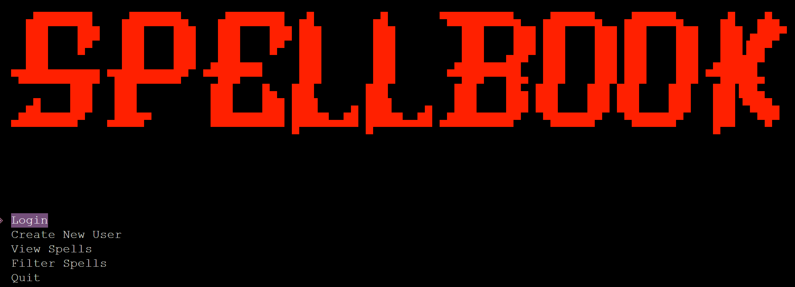
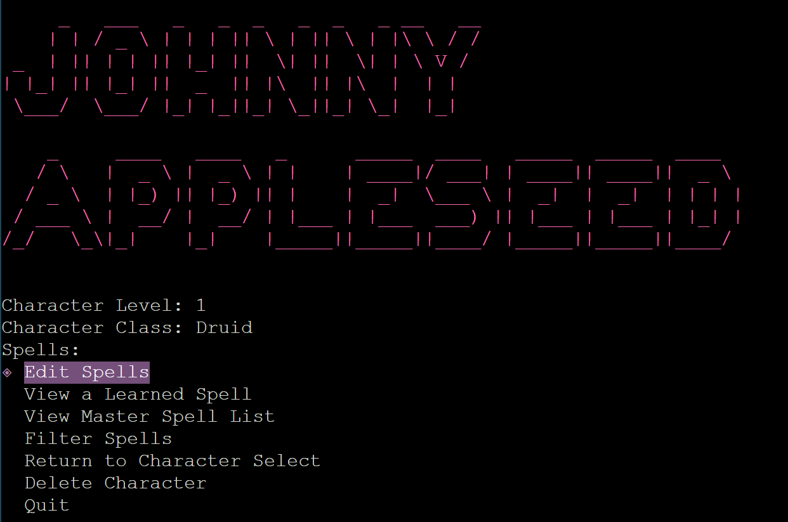
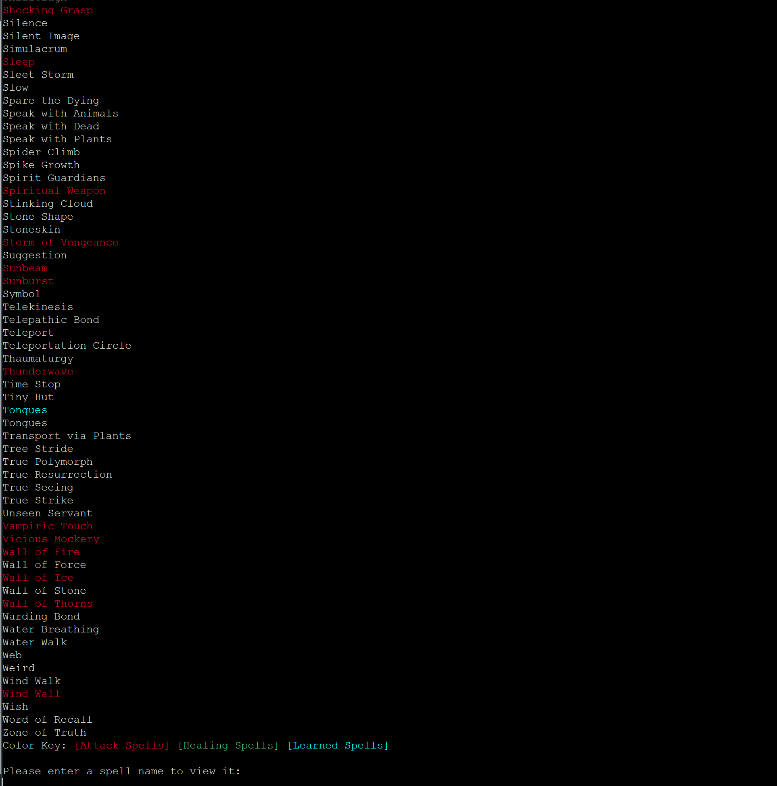
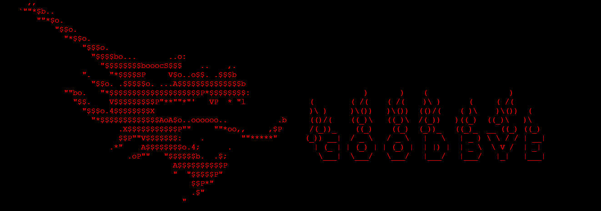

# Spellbook

## Description

Spellbook is a vital resource for all spellcasters in Dungeons and Dragons
fifth edition. Just as its name suggests, Spellbook utilizes a series of
databases to store a user's characters, and further, it keeps track of all
spells that character has learned throughout their campaign. The application
also allows the user to filter spells by class, casting level, school, and even
attack and healing spells. Pulling spells from the [D&D 5e API](https://www.dnd5eapi.co/), 
you can always be sure that the spell database is going to be filled with the
most up-to-date and accurate information.

## Table of Contents
- [Installation](#installation)
- [Usage](#Uuage)
    - [Creating an Account](#creating-an-account)
    - [Creating a Character](#creating-a-character)
- [Features](#features)
- [Screenshots](#screenshots)
- [Credits](#credits)
- [Contact](#contact)
- [Contributing](#contributing)
- [License](#license)

## Installation

- Clone this repository down to your local environment.
- Open the cloned directory and run `pipenv install` to install dependencies.
- Once dependencies are installed, run `pipenv shell` to open your virtual environment.
- Seeding databases
    - Run the following commands:
    ```
    alembic upgrade head    # Instantiates databases
    cd lib/db
    python3 seed.py    # Populates databases
    ```
- cd out of the db directory back into the lib folder
- Run `./cli.py` to open application

## Usage

On launch, you'll be presented with the Login screen for the app.



From here you can choose to Login or create a new account. You also have the option to view or filter the spell list for quick access from here if you'd like.

### Creating an Account

If you're reading this for the first time, you'll need to set up an account! Simply select "Create New Account" to get started, and enter your first name, last name, and desired username when prompted. Creating an account will automatically log you in to your character selection page. Now you can create your first character! 

### Creating a Character

Creating a character is a similar process to creating an account. Select "Create New Character" to proceed. You'll be prompted to enter your character's full name, level, and class. Doing so successfully will take you to that character's page:



From here you have a variety of options from which to choose. Now that we're logged in as Johnny Appleseed, we can go to any of the spell lists, filtered or otherwise, and easily add and remove spells to and from Johnny's spellbook.

---

## Features

- **Character Management**: Easily create and manage characters, specifying their names, levels, and classes.
- **Spell Tracking**: Keep track of the spells your characters have learned, complete with spell details.
- **Filtering and Sorting**: Filter spells by class, casting level, school, and type (attack or healing).
- **Dynamic Progress**: Utilize a dynamic progress bar during seeding and other data-intensive operations.

## Screenshots





## Credits
### External Libraries Used
- [Simple Terminal Menu](https://pypi.org/project/simple-term-menu/)
- [alive-progress](https://github.com/rsalmei/alive-progress#readme)
- [art](https://pypi.org/project/art/)
- [prettycli](https://github.com/noyoshi/prettycli)
- [Faker](https://faker.readthedocs.io/en/master/)
- [Fantasy Name Generator](https://pypi.org/project/fantasynames/)
- [Requests](https://pypi.org/project/requests/)

Spell Data gathered from the [D&D 5th Edition API](https://www.dnd5eapi.co/)

## Contact

Feel free to reach out to me on [github](https://github.com/shroobear) with any questions, comments, or concerns!

## Contributing

Contributions are welcome! If you have suggestions or find issues, please open an issue or pull request.

## License

This project is licensed under the [MIT License](https://opensource.org/license/mit/)

---
Thanks for checking out my application!

